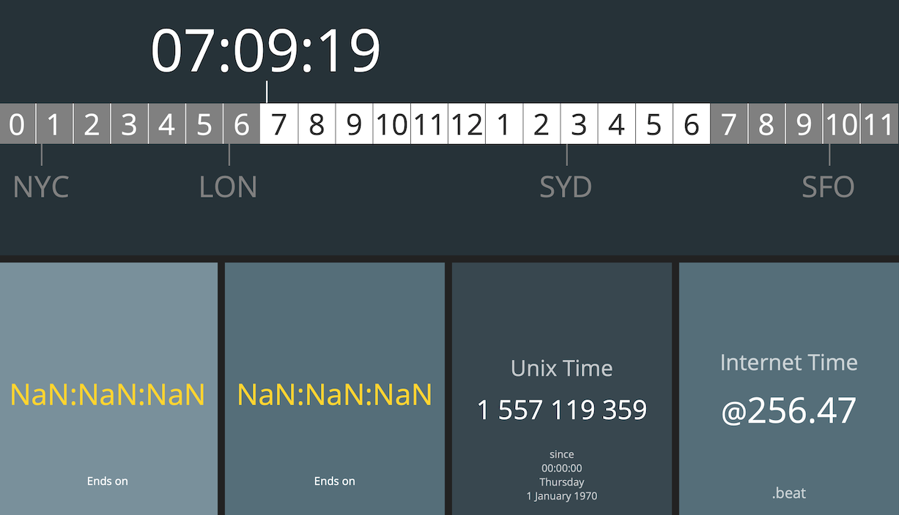
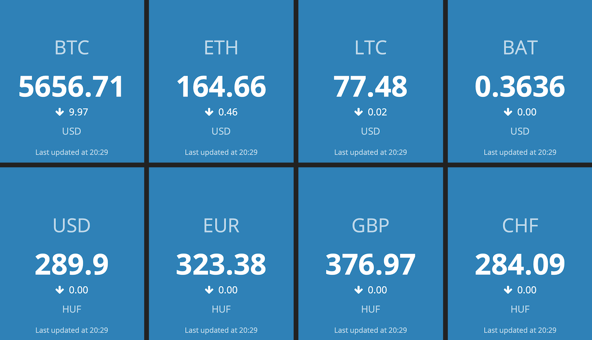

## Personal home dashboard based on the Smashing framework

For Smashing check out http://smashing.github.io/smashing for more information.

The dashboard pages are protected by HTTP basic auth (see `config.ru`), so first you need to set the auth credentials on line 21 in `config.ru`:

```ruby
@auth.provided? && @auth.basic? && @auth.credentials && @auth.credentials == ['', ''] # <=== change these!!
```

Once it's done in the root directory (in our case it's `smashing-dashboards`) for local testing start it with

```shell
smashing start
```

*Tip: for production you might want to run it in the background so start with*

```shell
smashing start -d
```

Then visit your local IP, or http://localhost on port 3030 including the dashboard name you wish to see.

Example:

http://192.168.100.101:3030/world-clock-and-countdowns

### World Clock and Countdowns

The World Clock and countdowns dashboard contains the following widgets:

* [world_clock](https://gist.github.com/weilu/7688343)
* [countdown](https://gist.github.com/ruleb/5353056)
* unix_time
* beat_time

The last two widgets are not written in Ruby. With a little bit of cheating these are written in JavaScript.



### Exchange rates

The Exchange rates dashboard lists crypto currencies as well as real currencies and regularly checks for rates in HUF.




Tested on

* Ubuntu 18.04.2 LTS
* Ruby 2.6.2
