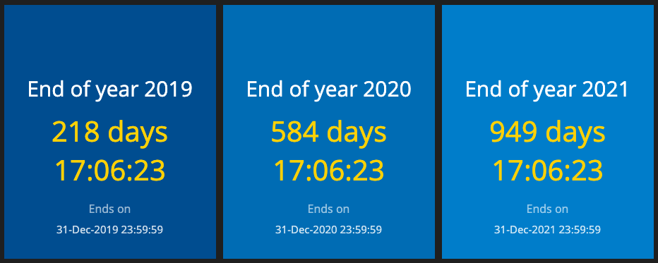

## Personal home dashboards based on the Smashing (Ruby) framework

For Smashing check out http://smashing.github.io/smashing for more information.

The dashboard pages are protected by HTTP basic auth (see `config.ru`), so first you need to set the auth credentials in a separate `.env` file:

Create a new `.env` file and add the following lines:

```shell
export BASIC_AUTH_USERNAME=<your username>
export BASIC_AUTH_PASSWORD=<your password>
```
*Note: The username or password must not contain special characters like '<' or '>'.*

Once it's done in the root directory (in our case it's `smashing-dashboards`) for local testing start it with

```shell
smashing start
```

*Tip: for production you might want to run it in the background so start with*

```shell
smashing start -d
```

Then visit your local IP, or http://localhost on port 3030 including the dashboard name you wish to see.

Example:

`http://<your-local-ip or localhost>:3030/time`

### World Clock and other times

The World Clock dashboard contains the following widgets:

* [world_clock](https://gist.github.com/weilu/7688343)
* time_local (displaying the local timestamp)
* time_utc (displaying the UTC timestamp)
* time_unix (displaying the Epoch timestamp)
* time_internet (displaying the time in .beats)

The bottom four widgets are not written in Ruby. With a little bit of cheating these are written in JavaScript.


### Countdowns

The Countdowns dashboard lists future dates to countdown to. It is based on the [Countdown](https://gist.github.com/ioangogo/7b9208d0ef41c90ec322/) widget.



### Crypto

The Crypto dashboard lists various crypto currencies. It is based on the default number widget.


### Exchange rates

The Exchange rates dashboard lists real currencies and regularly checks for rates in HUF. It is also based on the default number widget.


### Fuel prices

This dashboard contains info on fuel prices in HUF. I'm actually scraping those data using [Nokogiri](https://nokogiri.org).


### Random quotes

This dashboard get data from the https://wisdomapi.herokuapp.com/v1/random API.

I have also implemented my own version `quotes_local` where I'm getting the quotes in two languages from a JSON file hosted on AWS S3.


Tested on

* Ubuntu 18.04.2 LTS
* Ruby 2.6.2
